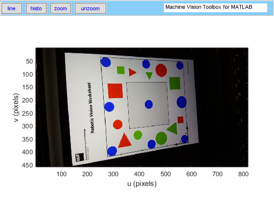

# Finding all the Positioning Points without any Parameters Adjusted by Experience

This is an approach to the homework of an online class called Robotic Vision: Making Robots See in Future Learn (https://www.futurelearn.com/courses/robotic-vision-making-robots-see). The assignment aims to fix a skewed figure using perspective rectification. The student is supposed to take a picture of printed robotic vision worksheet and find the coordinates of nine blue positioning points. Then, these circle coordinates are used to calculate a homography matrix which will help to fix the skewed figure using the HOMWARP function in Machine Vision Toolbox.

This assignment is initially designed for exercising necessary image processing skills. The suggested way in the class is to use a threshold method to find these blue circles. However, the threshold method is less useful when performing on the official figures extracted from QUT robot arm simulator. These figures in the simulator are taken from a monitor rather than printed pictures, which makes the picture color cast and contains strange waves. Some positioning points will be lost after performing the threshold method. Furthermore, the threshold method is an experimental way which is heavily influenced by different camera types and different illuminations. Working on Lab color space will be a little help, but it cannot solve the problem entirely. 

Our approach can find all the positioning points in the official figures extracted from QUT robot arm simulator. The parameters in this approach need not be precise settings and are not adjusted with experience. First, it locates easily identified points. Then, this approach estimates the possible coordinates where the lost points should be found based on the known point positions. Third, it constructs local regions of interest (LROIs) around these possible coordinates and tries to find the lost points. The experiment shows that all the positioning points can be found. 

The main program is in “TrygetColor.m”. 

- Step 1: Load figures. The figures in “data” directory are extracted from QUT robot arm simulator. All the figures in the directory can be used to test the algorithm. 

- Step 2: Preprocessing. The figure is transformed into Lab color space after adjusting the illumination.  

- Step 3: Find easily localizable points. We use k-means clustering method in “TrygetColor.m”. This algorithm is random. Sometimes, it will find other geometrical figures but the positioning points. In this condition, you can rerun the program. A more stable method for this step is to use “TrygetColor1.m”, which follows a beginner's guide in https://www.mathworks.com/help/images/examples/color-based-segmentation-using-the-l-a-b-color-space.html. However, some positioning points will be lost, whichever way you do it. 

- Step 4: Find all possible quadrilaterals that the known points can form. 

- Step 5: Among these quadrilaterals, we find the square whose center is near the origin of the image coordinate.

- Step 6: Use the four vertex coordinates of the square to fix the skewed figure. It will be less accurate with only four positioning points. We can improve the results after all the points are found. 

- Step 7: Find the new coordinates of easily localizable points. 

- Step 8: Estimate the coordinates of the lost points.

- Step 9: Construct LROIs around the known coordinates and the estimated coordinates.

- Step 10: Find all the positioning points in the LROIs. 

